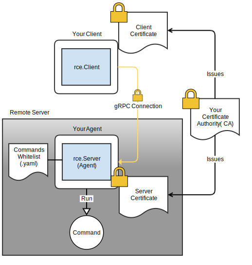

# RCE Agent

  

rce-agent is a gRPC-based Remote Command Execution (RCE) client and server.
The server (or "agent") runs on a remote host and executes a whitelist of
shell commands specified in a file. The client calls the agent to execute whitelist commands.
TLS is used to secure and authenticate both client and server.

rce-agent replaces SSH and other methods of remote code execution. There are no
passwords&mdash;only TLS certificates&mdash;and commands are limited to a whitelist.
This eliminates the need for SSH keys, passwords, or forwarding.

This package is meant to be integrated into your code. The `rce.Client` and `rce.Server` objects do all the heavy lifting
so your client and agent code can focus on their domain-specific logic. See `example/` for example code.

RCE Agent is also meant to be used with your private certificate authority (CA) for TLS-encrypted
communication and mutual authentication of client and agent.
(Setting up a private CA is beyond the scope of this project, but we highly suggest you use one!)
Normally, only the client verifies the server's TLS certificate (cert). For additional security,
your code should use [rce.TLSFiles](https://godoc.org/github.com/square/rce-agent#TLSFiles)
to create Go `tls.Config` which makes the server (agent) verify the client's cert, too.
